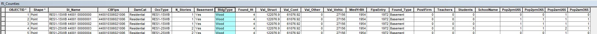
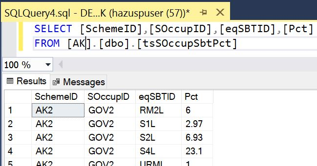
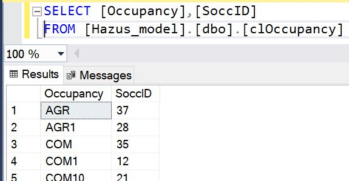
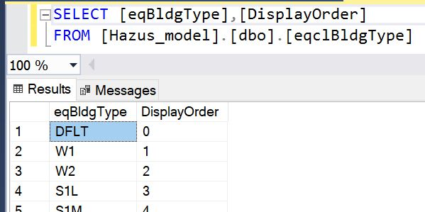
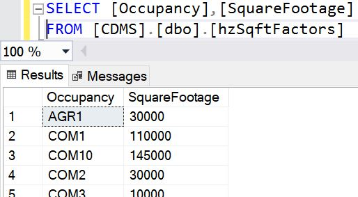

# __NSI2.0-Updater__
A python tool to update the Tsunami National Structure Inventory General Building Stock (tsNsiGbs state database table) for Hazus with data from NSI 2.0. This tool requires manual editing of the NSI 2.0 source data for input into the script as well as using the SQL Server Management Studio to truncate and load the script output data into the database.

------

## __Requirements__
  - Python 3.7 or greater with pyodbc and Pandas
  - Hazus 4.2.3 (requires ArcMap 10.6.1) or greater
  - SQL Server Management Studio (SSMS) installed

-----

## __To Use__

The NSI 2.0 data must be converted into a csv for use in the Python scripts. Once the script has run, the output can then be imported into the State Database using SSMS after removing the existing table rows (we don't want duplicated data).

### __STEP 1: Prepare NSI 2.0 data__

Skip to STEP 2 if you already have the NSI 2.0 csv files generated

  1. Obtain NSI 2.0 shapefiles/gpkg. This may be one or many files. You will need to combine them all into one file.

  2. Using ArcMap: 

      1. If there are multiple shapefiles for the State: merge all shapefiles into one shapefile or featureclass in a fgdb, for each state/territory, then export the table to a csv; else export the table to csv

          

      2. You can delete the NSI 2.0 merged shapefile or featureclass at this point

          

  3. Open the Python script with a text editor or Python Editor and modify the following:
    
      1. inputCsvPath = the file path to the csv you created in the previous step, i.e. 'C:/temp/15/HI15.txt'

          

      2. database = the sql server database name, ie 'HI' for Hawaii (watch out for 'AS' and sql reserved words, untested as of 2020-2-9)

          

      3. outputCsvPath = the file path where you want the output csv field to be, i.e. 'C:/temp/NSI2_HI_20200209.csv'

          

  4. Run the python script with a Python editor, i.e. IDLE so you can watch for any errors

      

  5. Once successfully run you can review the output csv file using excel or importing to ArcMap as xy data

      

### __STEP 2: Update State Database tsNsiGBS table__

  1. Using SQL Server Management Studio:

      1. Remove the existing rows in the [XX].[dbo].tsNsiGbs] table using the Truncate statement

          FIXME sample sql statement

          
      
      2. SQL SERVER IMPORT AND EXPORT DATA tool to import the csv to the [XX].[dbo].[tsNsiGbs] table, where XX is the State or Territory database, i.e. 'HI' for Hawaii

          

-----

## __Documentation__

### __Inputs__

#### __NSI__

#### __tsSOccupSbtPct__

NOTE: This table does not exist for all States so you may need to create it.

#### __clOccupancy__

#### __eqBldgTypeDisplayOrder | eqclBldgType__

#### __hzSqFtFactors__

### __Other__
For these databases only: AK, CA, HI, OR, WA, PR, VI, AS, GU, MP

United States Army Core of Engineers (USACE) [National Structure Inventory](https://www.hec.usace.army.mil/confluence/nsidocs/nsi-documentation-49251650.html) (NSI) 2.0 data to populate the Hazus Tsunami database table (tsNsiGbs). 

| Data | Notes |
| - | - |
|Specific Occupancy field | this might be the CoreLogic data|
|Hazus Seismic Design Levels | DesignLevel &#124; ID &#124; Desc fields|
|bldgtype field | source may be corelogic|
|||
|NSI 1.0 | What Hazus is using now|
|NSI "1.5" | replace proprietary attributes of corelogic with Hazus based assumptions|
|NSI 2.0 | NiyamIT script to incoporate/create|
|||
|Hazus General Building Stock| - |
|CoreLogic Data | building level data &#124; proprietary attributes|
|Zillow dataset | not used
|Microsoft/Bing dataset | not used
|HIFLD | not used but might be

-----

## __Contact__

Issues can be reported through the repository on Github (https://github.com/nhrap-dev/NSI2.0-Updater/br)

For questions contact fema-hazus-support@fema.dhs.gov